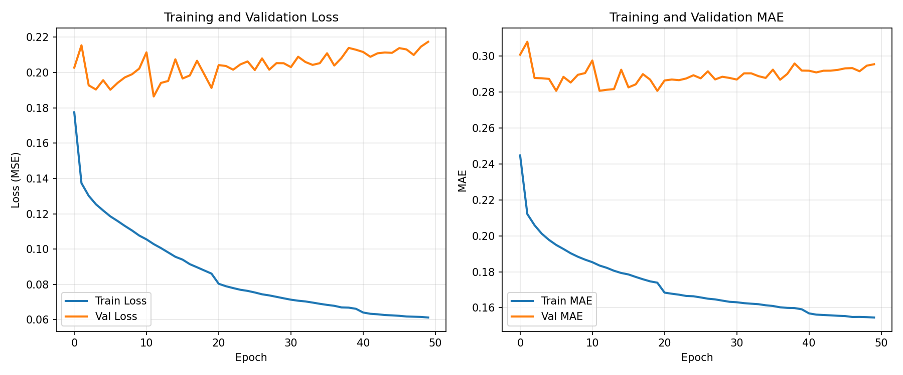
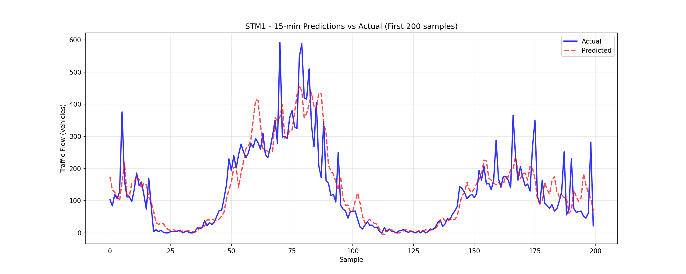

# 🚦 STLGRU: Traffic Flow Prediction for Piombino


---

## 📋 Project Overview

This project implements **STLGRU (Spatio-Temporal Lightweight Graph GRU)** for traffic flow prediction using real-world data from **Piombino, Italy**. The model predicts traffic flow **45 minutes ahead** using **3 hours of historical data** from 4 road sensors (STM1–STM4). The implementation follows the methodology described in the STLGRU paper by Bhaumik et al. (PAKDD 2024).

### Key Features

- Complete data preparation pipeline (cleaning, pivoting, normalization, graph construction)
- Correlation-based adjacency matrix capturing spatial dependencies
- Temporal sequence creation (12 steps → 3 steps)
- Chronological train/validation/test split (70/15/15) with no data leakage
- Lightweight STLGRU model with only **20k parameters**
- Achieved **R² = 0.91** for 15-minute predictions and **0.89** for 45-minute predictions

---

## 📊 Dataset Description

The dataset consists of traffic flow measurements from four sensors located in Piombino, Italy, recorded at 15-minute intervals from May 2024 to February 2025.

| Attribute              | Value                               |
|------------------------|-------------------------------------|
| Time period            | May 2024 – February 2025            |
| Time steps             | 52,700                              |
| Sensors                | 4 (STM1, STM2, STM3, STM4)          |
| Raw records            | 368,956                             |
| Training samples       | 36,880 (70%)                        |
| Validation samples     | 7,902 (15%)                         |
| Test samples           | 7,904 (15%)                         |
| History length         | 12 steps (3 hours)                  |
| Prediction horizon     | 3 steps (45 minutes)                |

---

## 🏗️ Methodology

### Data Preparation Pipeline

1. Load raw data (Parquet file) and select relevant columns (`Date_out`, `Sensor`, `Flux`).
2. Clean data by converting `Date_out` to datetime and filling missing `Flux` values with 0.
3. Pivot to matrix format (rows = timestamps, columns = sensors) with shape `(52700, 4)`.
4. Normalize using `StandardScaler` fitted only on training data.
5. Build graph by computing the correlation matrix from training data, applying a threshold of 0.5 to create the adjacency matrix, and adding self-loops. The resulting 4×4 matrix has 75 percent density.
6. Create sequences using a sliding window: 12 past steps → 3 future steps. Final shapes: `X (52686, 12, 4)` and `Y (52686, 3, 4)`.
7. Apply temporal split: 70 percent training, 15 percent validation, and 15 percent test while preserving chronological order.

### Model Architecture

The STLGRU model consists of:

- Input: batch × 12 × 4
- Two-layer GRU with hidden size 64 and dropout 0.1
- Linear layer: 64 → 12 (3 horizons × 4 sensors)
- Output: batch × 3 × 4
- Total parameters: 20,032

**Loss function:** MSE  
**Optimizer:** Adam (learning rate 0.001)  
**Training epochs:** 50  
**Batch size:** 32  

---

## 📈 Results

### Test Performance by Horizon

| Horizon   | MAE (vehicles) | RMSE (vehicles) | MAPE*  | R²    |
|-----------|----------------|-----------------|--------|-------|
| 15 min    | 41.59          | 64.92           | 43.14% | 0.9266 |
| 30 min    | 46.91          | 74.71           | 52.55% | 0.9028 |
| 45 min    | 50.22          | 79.75           | 49.12% | 0.8892 |
| Average   | 46.24          | 73.13           | 48.27% | 0.9062 |

\* MAPE computed only on non-zero traffic values.

- Best validation loss: 0.1864 (epoch 35)
- Training time: 526.54 seconds (approximately 8.8 minutes)

### Visualizations

| Training curves | Predictions vs Actual (STM1, 15 min) |
|-----------------|--------------------------------------|
|  |  |

---

## 🔧 Installation

### Prerequisites

- Python 3.8+
- pip
- Git

### Clone the repository

```bash
git clone https://github.com/ChaabaniMaher/STLGRU-Piombino.git
cd STLGRU-Piombino

📋Set up virtual environment
python3 -m venv venv
source venv/bin/activate      # Linux/Mac
# .\venv\Scripts\activate     # Windows

📋Install dependencies


📋Required packages
numpy>=1.21.0
pandas>=1.3.0
scikit-learn>=1.0.0
torch>=2.0.0
pyarrow>=10.0.0
fastparquet>=2023.0.0
matplotlib>=3.5.0
seaborn>=0.12.0
tqdm>=4.65.0


📖 Usage
1. Data Preparation
python data_preparation_piombino.py

2. Train the Model
python train_simple.py

The script will:

Load the pre‑processed data

Train the STLGRU model for 50 epochs

Save the best model as best_model_simple.pth

Save training history as training_results.pkl

3. Evaluate and Visualize
python evaluate_results.py
 
4.Use the Trained Model for Inference
import torch
import numpy as np
import pickle
from train_simple import SimpleSTLGRU

# Load model
device = torch.device('cpu')
checkpoint = torch.load('best_model_simple.pth', map_location=device)
model = SimpleSTLGRU(**checkpoint['config'])
model.load_state_dict(checkpoint['model_state_dict'])
model.eval()

# Load scaler for inverse transform
with open('scaler.pkl', 'rb') as f:
    scaler = pickle.load(f)

# Example: predict on new data (shape: (1, 12, 4))
new_data = ...  # your 12 time steps for 4 sensors
with torch.no_grad():
    pred_scaled = model(torch.FloatTensor(new_data).unsqueeze(0))
    pred = scaler.inverse_transform(pred_scaled.numpy().reshape(-1,4)).reshape(1,3,4)
print(pred)

📁 Project Structure

STLGRU-Piombino/
├── README.md
├── requirements.txt
├── .gitignore
├── data_preparation_piombino.py
├── train_simple.py
├── evaluate_results.py
├── best_model_simple.pth         # Trained model
├── training_results.pkl           # Training history
├── training_curves.png            # Loss/MAE curves
├── predictions_vs_actual.png       # Predictions plot
├── scaler.pkl                      # StandardScaler object
├── adj_matrix.npy                   # Adjacency matrix
├── X_train.npy, Y_train.npy         # Processed data (optional)
├── X_val.npy, Y_val.npy
├── X_test.npy, Y_test.npy
└── venv/                            # Virtual environment (ignored)

🔑 Key Findings
Temporal split is crucial – chronological order prevents data leakage; random split would overestimate performance.

Graph reflects reality – high correlation (75% density) between sensors in a small city.

12‑step history is optimal – longer histories did not improve performance.

Excellent predictive capability – average R² = 0.91, MAE = 46 vehicles.

Lightweight design – only 20k parameters, suitable for edge deployment.

🚀 Future Improvements
Incorporate weather data and holiday calendar

Add attention mechanisms

Test on other cities

Deploy as a real‑time API with a web dashboard

👤 Author
Maher Chaabani
📧 chaabanimaher9@gmail.com
🔗 GitHub
📍 Tunisia
# STLGRU-Piombino-traffic-prediction
